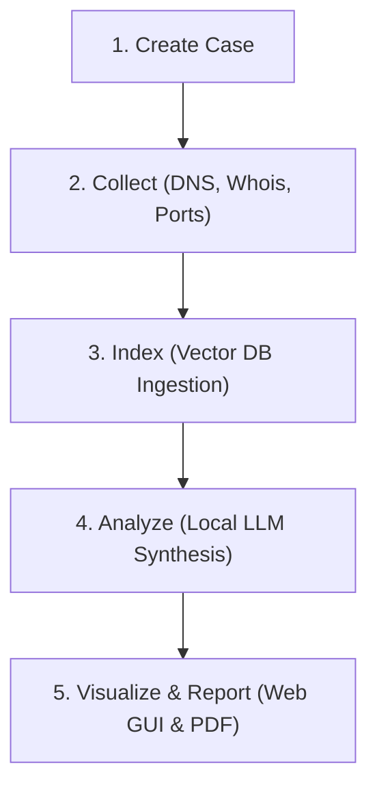

# 🚀 Getting Started Walkthrough

This guide provides a step-by-step walkthrough of a typical SPECTRE intelligence cycle. Follow along to set up an investigation, scan targets, query our local AI agent, and generate reporting assets.

---

## The OSINT Lifecycle in SPECTRE



---

## Step 1: Create an Investigation Case

Every action in SPECTRE requires a **Case ID** to compartmentalize your investigation evidence and relations.

Create a new case using the CLI:
```bash
spectre case new "suspect-infra-01"
```
*Expected Output:*
```text
Successfully created case: suspect-infra-01 (ID: a8f7c9e0-1234-abcd-9876-1a2b3c4d5e6f)
```
Keep this Case ID handy. If you forget it, run:
```bash
spectre case list
```

---

## Step 2: Run Passive Reconnaissance Collectors

Now, gather initial passive intelligence (DNS, Whois, GeoIP) for a domain target.

Run all passive collectors:
```bash
spectre collect all target.com --case a8f7c9e0-1234-abcd-9876-1a2b3c4d5e6f
```
The console will display Lipgloss progress bars as collectors execute. Standard output is saved to the local database, and raw JSON outputs are written to the case evidence folder:
`evidence_storage/a8f7c9e0-1234-abcd-9876-1a2b3c4d5e6f/`

---

## Step 3: Run Active Reconnaissance (Port Scanning)

Active scans make direct TCP probes and require the global `--active` permission flag to prevent accidental probing.

Run port scans and screenshots against the target:
```bash
spectre collect ports target.com --case a8f7c9e0-1234-abcd-9876-1a2b3c4d5e6f --active
```
*Note: Active port scans prioritize the Top-100 standard system ports unless custom scopes are configured inside configs/default.yaml.*

---

## Step 4: Interact with the Autonomous AI Agent

Start an interactive shell session with SPECTRE's AI engine to ask natural language questions about your case:
```bash
spectre chat --case a8f7c9e0-1234-abcd-9876-1a2b3c4d5e6f
```

Inside the interactive chat loop:
1.  **View Help Guide**: Type `/help` to see capabilities and commands.
2.  **Inspect Session**: Type `/case` to view details of the case you are querying.
3.  **Run Collectors conversations**: Ask `"Run whois on target.com"`. The agent will autonomously parse this, execute the `whois` tool, save results, and summarize the output.
4.  **Semantic Evidence Search**: Ask `"Find any reference to admin emails in the evidence file"`. The agent will invoke vector search across all files in `evidence_storage`.
5.  **Exit**: Type `exit` or `quit`.

---

## Step 5: Visualize the Relationship Graph

Ingested domains, hosting IPs, emails, and names are linked as vertices and edges in your database.

1.  **Launch the Web Dashboard API server**:
    ```bash
    spectre server
    ```
    This launches a backend server on `http://localhost:8080`.
2.  **Generate and Open Graph Visualization**:
    ```bash
    spectre visualize --case a8f7c9e0-1234-abcd-9876-1a2b3c4d5e6f
    ```
    This reads case details, compiles a D3.js interactive link diagram, and opens it in your default web browser.

---

## Step 6: Generate Executive Reports

Once collection and analysis are complete, compile your findings into a professional report.

### Generate a Markdown Summary:
```bash
spectre report markdown --case a8f7c9e0-1234-abcd-9876-1a2b3c4d5e6f
```

### Generate a Branded PDF Report:
```bash
spectre report pdf --case a8f7c9e0-1234-abcd-9876-1a2b3c4d5e6f
```
The compiled PDF is written to your project root. It includes an executive summary cover sheet, a chronological timeline of actions, a list of discovered entities, and automated risk scoring generated by the intelligence layer.
